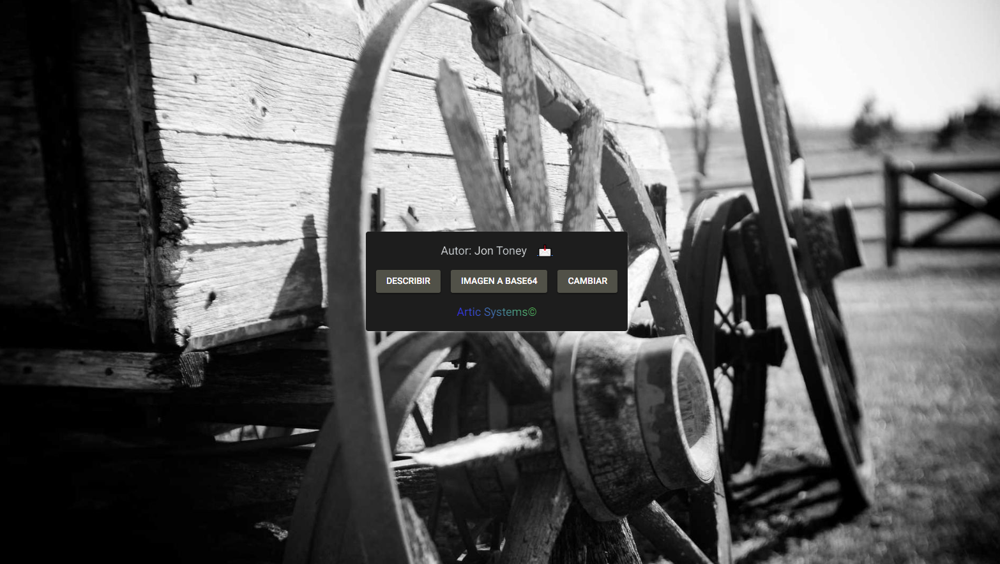

## ImaGEN

ImaGEN is my first project developed with NiceGUI. It is an application that uses an API to fetch random images and display them in a graphical interface.

**Key Features:**

- Fetching random images: ImaGEN connects to an image API and downloads a random image each time the application is executed.
- Intuitive graphical interface: The user interface is simple and user-friendly, allowing users to interact with the application seamlessly.
- Included Image Caption AI Model.
- Image display: Downloaded images are elegantly displayed in the graphical interface.

### Screenshots



### Installation

To run ImaGEN, you need to have Python installed on your system, and then follow these steps:

1. Download ImaGEN.py from [Here](./Completed/ImaGEN/).
2. Install dependencies from [Here](./Completed/ImaGEN/) with.
```bash
pip install -r requirements.txt
```
3. Run ImaGEN
```bash
python ImaGEN.py
```
